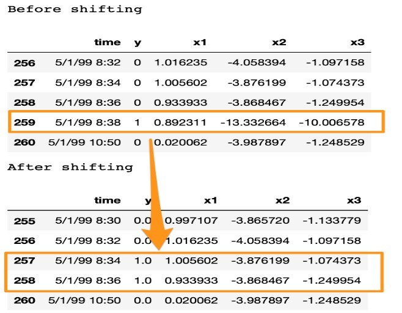
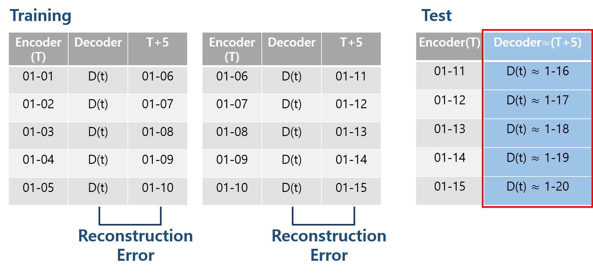

# LSTM-Autoencoder-for-Anomaly-Detection

## MODEL 1. LSTM Autoencoder through Curve Shifting

#### Curve Shifting

 

## MODEL 2. LSTM Autoencoder + Classification 

#### Transform Data for Reconstruction Error

